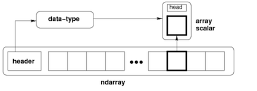
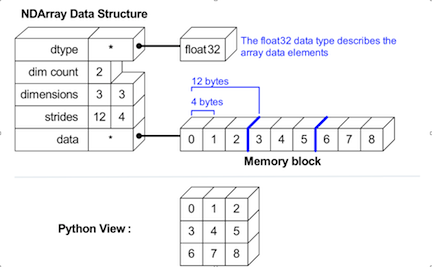

.. numpyarray:

=============
Numpy Ndarray
=============

- A ndarray is an N-dimensional homogeneous collection of “items” of the same bytes.  

PyArrayObject in ndarraytypes.h
===============================

`ndarraytypes.h <https://github.com/numpy/numpy/blob/master/numpy/core/include/numpy/ndarraytypes.h>`_::

    typedef struct PyArrayObject {
            PyObject_HEAD
            char *data;             /* pointer to raw data buffer */
            int nd;                 /* number of dimensions, also called ndim */
            npy_intp *dimensions;   /* size in each dimension */
            npy_intp *strides;      /*
                                     * bytes to jump to get to the
                                     * next element in each dimension
                                     */
            PyObject *base;         /*
                                     * This object should be decref'd upon
                                     * deletion of array
                                     *
                                     * For views it points to the original
                                     * array
                                     *
                                     * For creation from buffer object it
                                     * points to an object that shold be
                                     * decref'd on deletion
                                     *
                                     * For UPDATEIFCOPY flag this is an
                                     * array to-be-updated upon deletion
                                     * of this one
                                     */
            PyArray_Descr *descr;   /* Pointer to type structure */
            int flags;              /* Flags describing array -- see below */
            PyObject *weakreflist;  /* For weakreferences */
    } PyArrayObject;

