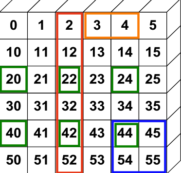
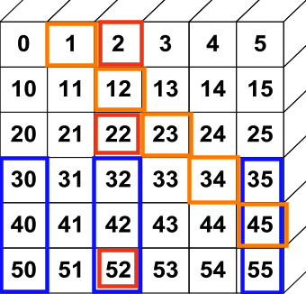
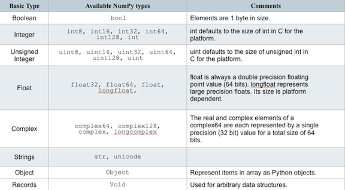
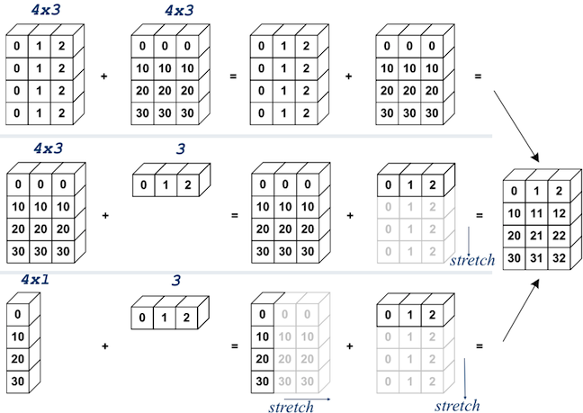
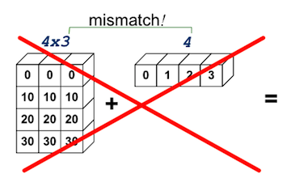
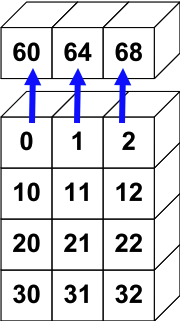
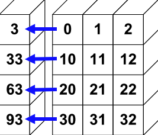

.. numpyfeatures:

========
Features
========

=============
Array Slicing
=============

Basics
======

ARR[start:stop:step, start:stop:step, ..,]::

  >>> a = np.array([range(6)]*6)
  >>> b = np.array([0,10,20,30,40,50])
  >>> a = a + b[:, np.newaxis]
  >>> a[0,3:5]
  array([3, 4])
  
  >>> a[4:,4:]
  array([[44, 45],       
         [54, 55]])
  
  >>> a[:,2]
  array([2,12,22,32,42,52])

  >>> a[2::2,::2]
  array([[20, 22, 24], 
         [40, 42, 44]])

Fancy
=====

Indexing with index/logical arrays::

  >>> a[(0,1,2,3,4),(1,2,3,4,5)]
  array([ 1, 12, 23, 34, 45])
  
  >>> a[3:,[0, 2, 5]]
  array([[30, 32, 35],       
         [40, 42, 45],
         [50, 52, 55]])
  
  >>> mask = array([1,0,1,0,0,1], dtype=bool) 
  >>> a[mask,2]
  array([2,22,52])
  

=========
Reshaping
=========

Shape and Reshape
=================
::

 >>> a = arange(6)
 >>> a
 array([0, 1, 2, 3, 4, 5])
 >>> a.shape
 (6,)
 
 # reshape array in-place to  2x3
 >>> a.shape = (2,3)
 >>> a
 array([[0, 1, 2],
        [3, 4, 5]])

=========
Transpose
=========

::

 >>> a = array([[0,1,2],
 ...            [3,4,5]])

 >>> a.transpose() 
 array([[0, 3],
        [1, 4],
        [2, 5]])
 
 # The .T attribute is
 # equivalent to transpose().
 >>> a.T
 array([[0, 3],
        [1, 4],
        [2, 5]])

Returns a view::

 >>> b = a.T
 
 # Changes to b alter a.
 >>> b[0,1] = 30
 >>> a
 array([[ 0,  1,  2],
        [30,  4,  5]])

======
Dtypes
======

Common dtypes on an ndarray

=================
Structured Arrays
=================

Elemts of array can be any fixed-sized data structure::
 
 >>> adtype = np.dtype([('Name', 'S10')
                       ,('Age', 'int')
                       ,('Weight', 'float')])

================
Binary Operators
================
 - a + b  =>  add(a,b)
 - a - b  =>  subtract(a,b)
 - a % b  =>  remainder(a,b)
 - a * b  =>  multiply(a,b)
 - a / b  =>  divide(a,b)
 - a ** b =>  power(a,b)

Scalar Multiplication::

 >>> a = array((1,2))
 >>> a*3.
 array([3., 6.])a

Element Addition::

 >>> a = array([1,2])
 >>> b = array([3,4])
 >>> a + b
 array([4, 6])
 
Operator Function Addition::

 >>> add(a,b)
 array([4, 6])

Inplace operations::

 >>> add(a,b,a) # a += b
 array([4, 6])
 >>> a
 array([4, 6])

=====================
Comparision Operators
=====================

 - equal (==)
 - greater_equal (>=)
 - logical_and 	
 - logical_not 	
 - not_equal (!=)
 - less (<)
 - logical_or	
 - greater (>)
 - less_equal (<=)
 - logical_xor

Be careful with if statements involving numpy arrays.
To test for equality of arrays, don't do::

 >>> if a == b:

do this instead::
 
 >>> if all(a==b)

for floating point::

 >>> if allclose(a, b)

 >>> a = array(((1,2,3,4),(2,3,4,5)))
 >>> b = array(((1,2,5,4),(1,3,4,5)))
 >>> a == b
 array([[True, True, False, True],
        [False, True, True, True]])
 # functional equivalent
 >>> equal(a,b)
 array([[True, True, False, True],
        [False, True, True, True]])
 

============
Broadcasting
============
The term broadcasting describes how numpy treats arrays with different shapes during arithmetic operations. 
Subject to certain constraints, the smaller array is “broadcast” across the larger array so that they have compatible shapes. 
Without making needless copies of data. 
:: 

 >>> a = np.array((0,10,20,30)*3).reshape(3, 4).T
 >>> b = np.array((0,1,2)*4).reshape(4,3) 
 array([[ 0,  1,  2],
        [10, 11, 12],
        [20, 21, 22],
        [30, 31, 32]])

 >>> a = np.array((0,10,20,30)*3).reshape(3, 4).T
 >>> b = np.array((0,1,2))
 array([[ 0,  1,  2],
        [10, 11, 12],
        [20, 21, 22],
        [30, 31, 32]])

 >>> a = np.array((0,10,20,30))[:,None]
 >>> b = np.array((0,1,2))
 array([[ 0,  1,  2],
        [10, 11, 12],
        [20, 21, 22],
        [30, 31, 32]])

Mismatch
========

>>> a = np.array((0,10,20,30)*3).reshape(3, 4).T
>>> b = array((0,1,2,3))
>>> a + b # error
>>> y = a + b[:, np.newaxis]

==========================
Universal Function Methods
==========================

A universal function (or ufunc for short) is a function that operates on
ndarrays in an element-by-element fashion, supporting array broadcasting,
type casting, and several other standard features. 

Set of `ufuncs <http://docs.scipy.org/doc/numpy/reference/ufuncs.html#math-operations>`_.

Sum by column (default)::

 >>> add.reduce(a)
 array([60, 64, 68])

Sum by row (specify axis 1)::

 >>> add.reduce(a,1)
 array([ 3, 33, 63, 93])

