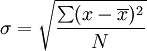

.. apnumpyset:

===========
Problem Set
===========

Well only one problem.

Problem set
===========

1. Compute the standard deviation by symbol, using the 
   closing prices array.

   - Imperative style
   - Array Style

**Without using numpy's standard deviation function**

Bonus
-----

1. Compute the standard deviation using the
   array style as a "one-liner".

2. Verify your answer by comparing it against
   numpy's builtin standard deviation function 
   (also as a one-liner if you can). 
